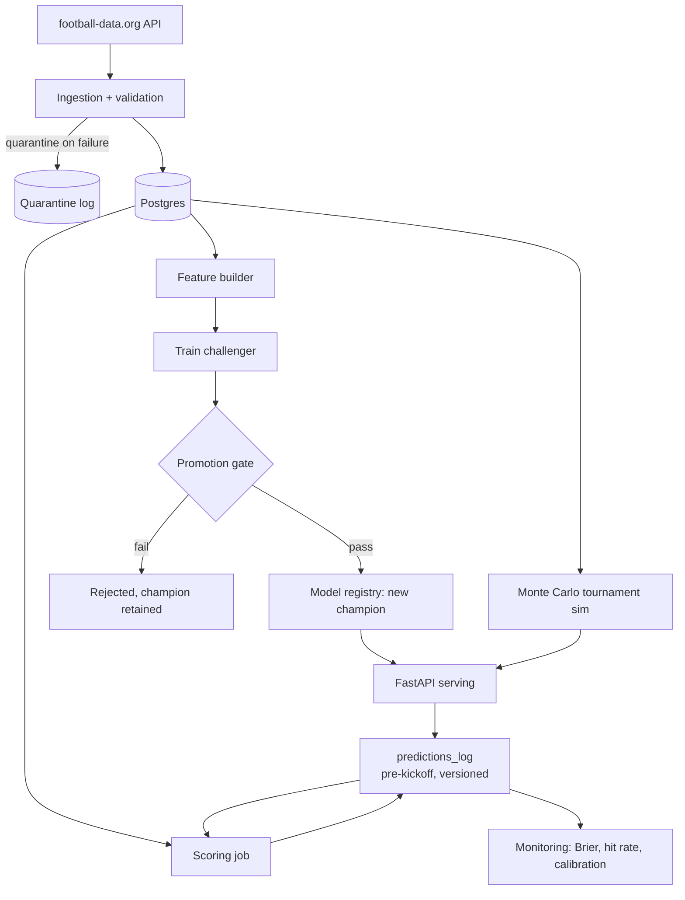

# MatchCast

[](https://github.com/beawesome8/MatchCast/actions/workflows/ci.yml)
[](https://github.com/beawesome8/MatchCast/actions/workflows/retrain.yml)

A self-retraining football match prediction pipeline, built end-to-end during the live FIFA World Cup 2026. Ingests real tournament data, retrains itself on a schedule, only promotes a new model when it actually beats the current one, and logs every prediction before kickoff so its accuracy is verifiable — not just claimed.

> **Live status:** the pipeline has autonomously retrained and evaluated multiple model versions against live World Cup 2026 data. See the [Actions tab](https://github.com/beawesome8/MatchCast/actions) for the full history of every retrain and promotion decision, and `GET /monitoring/performance` for real accuracy numbers as scored predictions accumulate.

## Why this project exists

Most sports-prediction repos report backtested accuracy — numbers computed after the fact, on data the model implicitly had a chance to overfit to. Those numbers are easy to produce and impossible for a reader to verify.

MatchCast does something different: every prediction is logged **before kickoff**, timestamped and tied to the exact model version that made it, then scored **after** the match finishes. The `/monitoring/performance` endpoint reports real, running accuracy over that log — a public, tamper-evident track record built during an actual live tournament, not a backtest.

The model itself (XGBoost, three-class win/draw/loss) is deliberately simple. The point is the operational machinery around it:

- **Automated, scheduled retraining** — a GitHub Actions cron job ingests fresh results and retrains every 6 hours, unattended
- **Champion/challenger promotion gate** — a retrained model only replaces the current champion if its held-out Brier score genuinely improves on it; every promotion or rejection is recorded with a specific, readable reason
- **Model registry** — every trained model is versioned, with its serialized weights stored directly alongside its metrics (so a model trained on an ephemeral CI runner is never lost)
- **Data validation with quarantine** — malformed API responses are rejected wholesale and preserved for inspection, never silently loaded
- **Verifiable prediction logging** — every served prediction is recorded pre-kickoff and scored post-match, feeding real Brier score, hit rate, and calibration metrics
- **Monte Carlo tournament simulation** — full remaining-bracket win probabilities, using FIFA's officially published knockout topology, not a guessed one

## Architecture



## API

| Endpoint | Description |
|---|---|
| `GET /health` | Confirms database connectivity and reports the current champion |
| `GET /predictions/upcoming` | Win/draw/loss probabilities for scheduled matches, logged on read |
| `GET /monitoring/performance` | Real Brier score, hit rate, and calibration over scored predictions |

Tournament-winner simulation and the live in-match updater are currently run as scripts (`python -m matchcast.simulate`) rather than exposed as endpoints — see [Roadmap](#roadmap).

## Quick start

```bash
cp .env.example .env          # add your football-data.org API token and a Postgres URL
pip install -r requirements-dev.txt
pip install -e .
python -c "from matchcast.db import init_db; init_db()"
python -m matchcast.pipeline   # ingest, train, and promote a first model
uvicorn matchcast.api:app --reload
```

Or via Docker:

```bash
docker compose up --build
```

## Documented limitations

Built under a real tournament deadline, with every trade-off named rather than hidden:

- **Elo bootstrap.** Team ratings start at a neutral 1500 and are computed self-consistently from in-tournament results only — there was no time to source and validate a real pre-tournament Elo snapshot. Early-tournament Elo differentials carry weak signal; this sharpens as more matches complete.
- **Small model, small data.** ~90 training rows as of the Round of 16. The model is deliberately shallow (25 trees, depth 2, L2-regularized) to avoid overfitting at this scale; several distinct matchups currently receive identical predicted probabilities as a direct consequence.
- **Live updater is math-only.** The Skellam-based in-match probability model (`matchcast/live.py`) is fully implemented and tested, but not yet wired to a live score feed or exposed as an API endpoint — that integration needs a genuinely in-progress match to verify against.
- **football-data.org free tier delivers delayed scores**, not real-time — acceptable for scheduled retraining, a real constraint for any future live-odds feature.
- **Prediction-log idempotency is application-level**, not a database constraint — acceptable at current traffic, a known gap under real concurrent load.

Full design rationale: [DESIGN.md](DESIGN.md).

## Tech stack

Python 3.12 · FastAPI · SQLAlchemy · XGBoost · pandera · Postgres (Neon) · GitHub Actions · Docker

## Roadmap

- [x] Phase 0 — Repo skeleton: Docker, CI, pinned dependencies
- [x] Phase 1 — Ingestion + data validation
- [x] Phase 2 — Feature pipeline + baseline model + registry
- [x] Phase 3 — Champion/challenger gate + scheduled retraining
- [x] Phase 4 — Prediction API + versioned prediction logging
- [x] Phase 5 — Monte Carlo tournament simulation
- [ ] Phase 6 — Live in-match win probability (math complete and tested; API wiring pending a live match)
- [x] Phase 7 — Monitoring dashboard
- [ ] Phase 8 — Post-tournament retrospective

## License

MIT