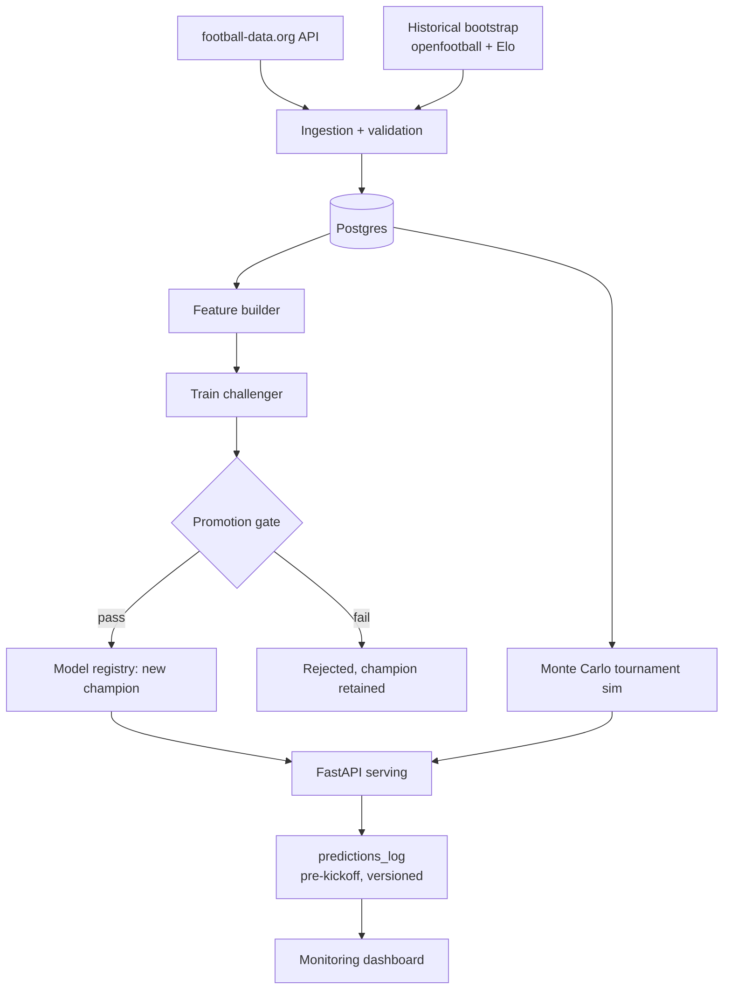

# MatchCast

An end-to-end MLOps project: a match-outcome prediction system for the FIFA World Cup 2026 that ingests live tournament data, retrains itself after every matchday, and only promotes new models when they beat the current champion.

> **Status:** As of the last scheduled run, the pipeline has autonomously retrained and evaluated 2 model versions against live World Cup 2026 data — see the [Actions tab](https://github.com/beawesome8/MatchCast/actions) for the full history of every retrain and promotion decision.
> Live demo link and model performance results will appear here.

## Why this project exists

Most sports-prediction repos show backtested accuracy, which is easy to overfit and impossible to verify. This project logs every prediction **before kickoff**, timestamped and tied to a model version, then scores them against real results — a public, verifiable track record built during a live World Cup.

The model itself (XGBoost, win/draw/loss) is deliberately simple. The point is the machinery around it:

- **Automated retraining** after each matchday via a scheduled GitHub Actions pipeline
- **Champion/challenger promotion gate** — a retrained model is only promoted if it doesn't degrade calibration on held-out and live-logged predictions
- **Model registry** with versioned artifacts, data snapshot hashes, and one-command rollback
- **Data validation** at ingestion (schema + sanity checks, quarantine on failure)
- **Monitoring** — Brier score over time, calibration plots, data freshness

## Architecture



## Quick start

```bash
cp .env.example .env          # add your football-data.org API token
docker compose up --build     # starts Postgres + the app
```

Full setup and development docs will land as each phase ships. See [DESIGN.md](DESIGN.md) for the build plan.

## Roadmap

- [x] Phase 0 — Repo skeleton: Docker, CI, pinned dependencies
- [x] Phase 1 — Ingestion + data validation
- [x] Phase 2 — Feature pipeline + baseline model + registry
- [x] Phase 3 — Champion/challenger gate + scheduled retraining
- [x] Phase 4 — Prediction API + versioned prediction logging
- [ ] Phase 5 — Monte Carlo tournament simulation
- [ ] Phase 6 — Live in-match win probability
- [ ] Phase 7 — Monitoring dashboard
- [ ] Phase 8 — Post-tournament retrospective

## License

MIT
